# 🚀 ReachOut – One Link to Rule All Socials

> 🔗 Your **digital identity** deserves more than scattered links.  
> 🎯 ReachOut connects all your social media into one interactive profile, with QR code access and powerful analytics.
> 🔗 ReachOut lets users consolidate all their social media into a **single shareable link** with a **QR code** and **advanced analytics** – powered by this web frontend.

---

## 📦 Part of a Full-Stack Ecosystem

| Repo              | Description                                                              |
|-------------------|---------------------------------------------------------------------------|
| 🔹 `reach_out_web`      | **[This repo]** – React.js web app for user profiles and analytics dashboard |
| 🔸 [`reach_out_backend`](https://github.com/krishnanpandya007/reach_out_backend) | Django-based REST API and user data management                     |
| 🔹 [`reach_out_flutter`](https://github.com/krishnanpandya007/reach_out_flutter) | Cross-platform mobile app built in Flutter                         |
| 🔸 [`reachoutd`](https://github.com/krishnanpandya007/reachoutd) | Background services: cronjobs, email dispatchers, and automation scripts |

[`Full Report`](public/showcase/report.pdf)

> 🧩 Together, these 4 repos form the complete **ReachOut Platform**.

---

## ✨ Features

- ✅ One-tap access to all your socials
- 📊 Custom analytics dashboard (visits, geo-stats, link clicks)
- 🧠 Scalable Django backend with secure APIs
- 📱 Cross-platform app (Flutter + Web)
- 🎨 Modern UI/UX (Figma-designed)
- 🔒 Developer account integrations for data safety
- 🆔 Unique QR code for every user profile

---

## 🧰 Tech Stack

| Layer        | Technology     |
|--------------|----------------|
| Frontend     | React.js, TailwindCSS |
| Mobile App   | Flutter        |
| Backend/API  | Django + DRF   |
| Database     | PostgreSQL     |
| Hosting      | Vercel (Web), DigitalOcean (API) |
| UI/UX Design | Figma          |
| Analytics    | Custom Charts with Chart.js / Recharts |

---
## 🎨 Design Showcase

Here’s a look at our creative vision across platforms:

### 🖥️ Web Platform (React)

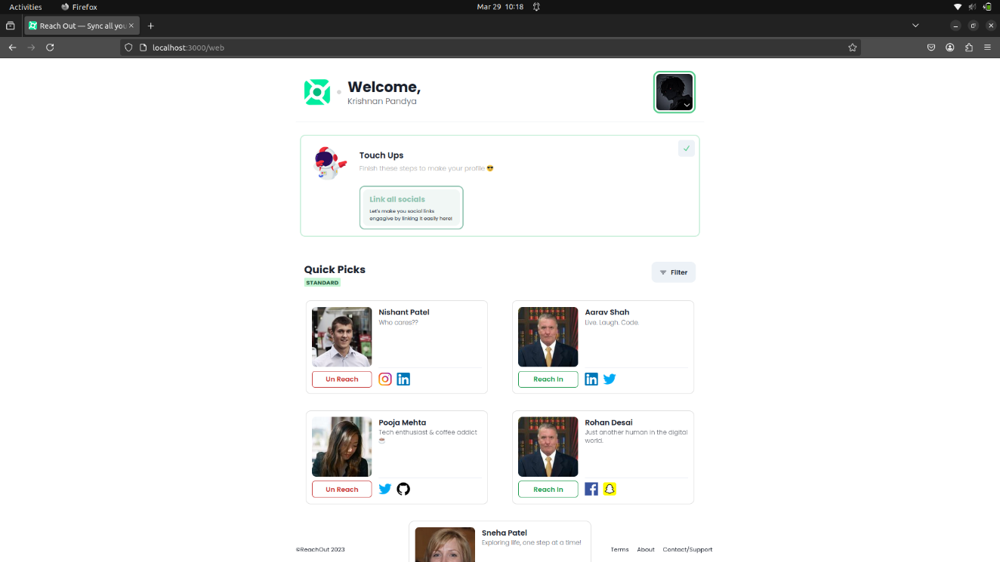
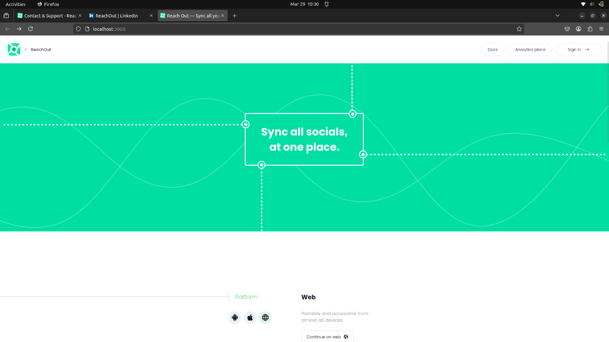
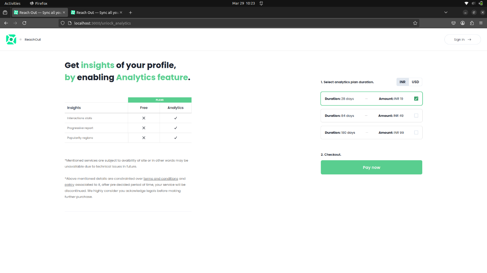
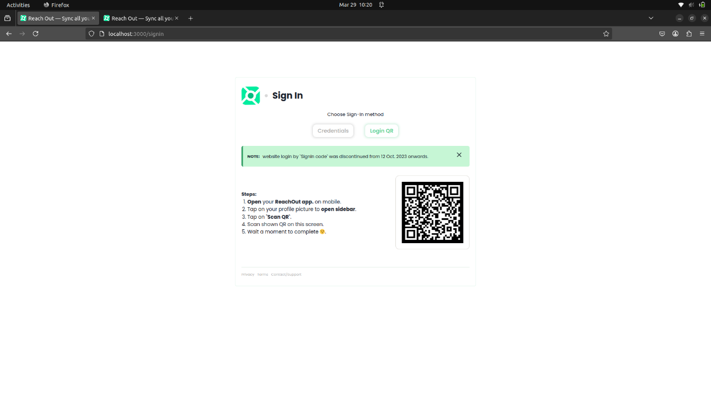

---

### 📱 Mobile App (Flutter)

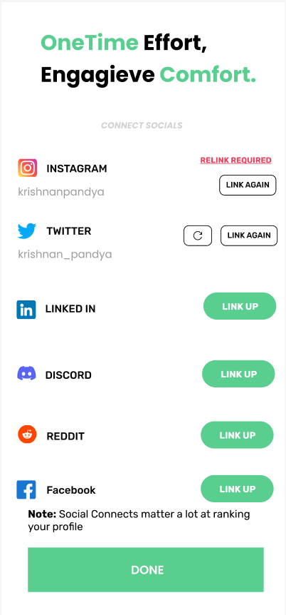 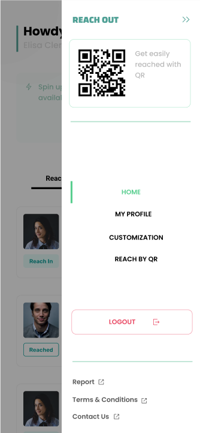
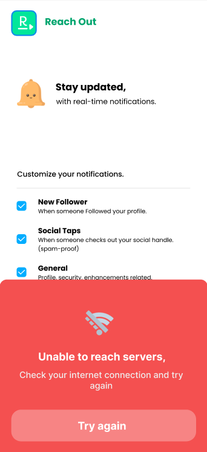
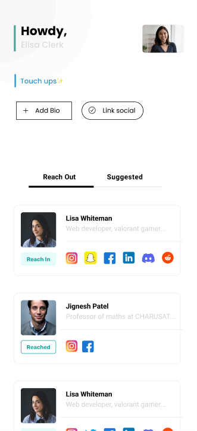
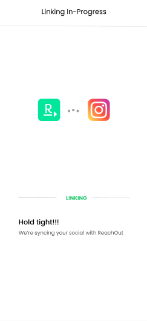
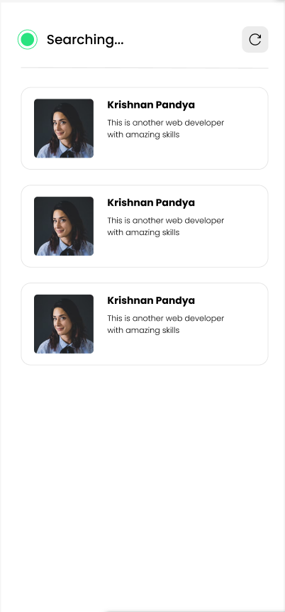
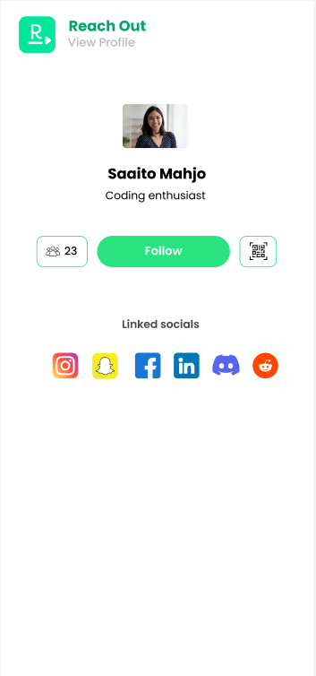
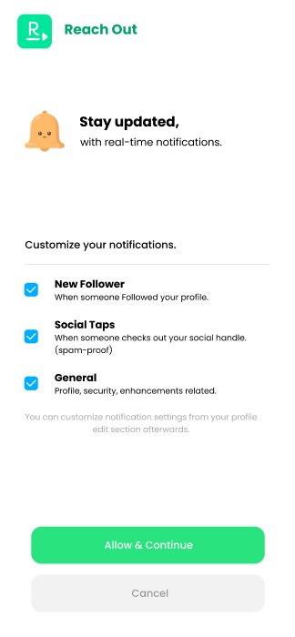
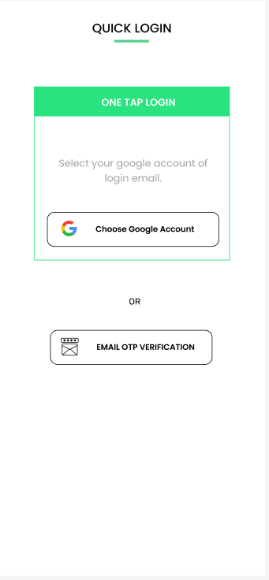
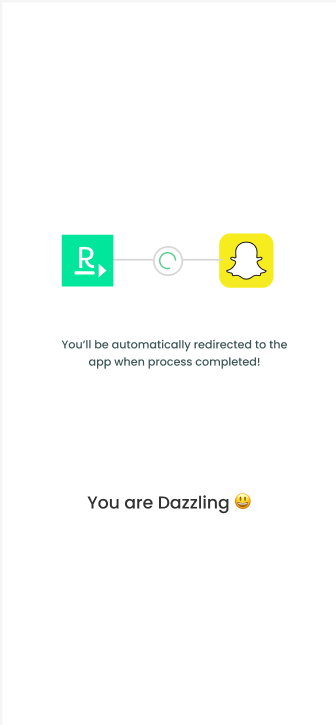
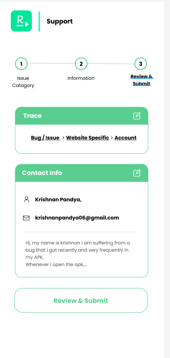

---

### 📢 Marketing Posters

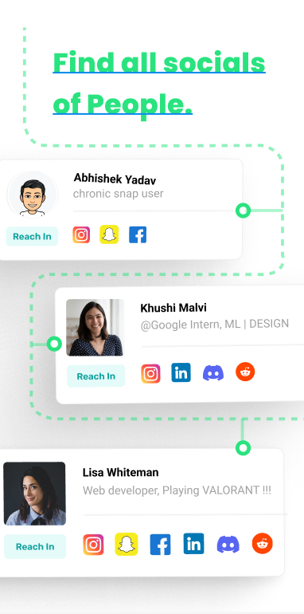 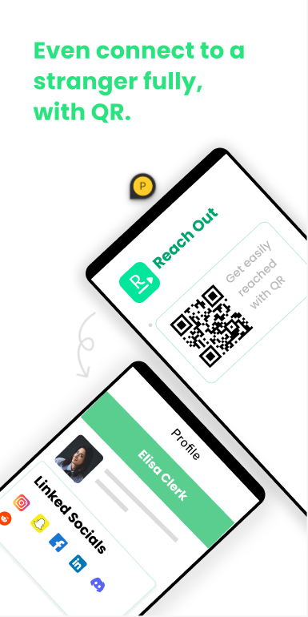

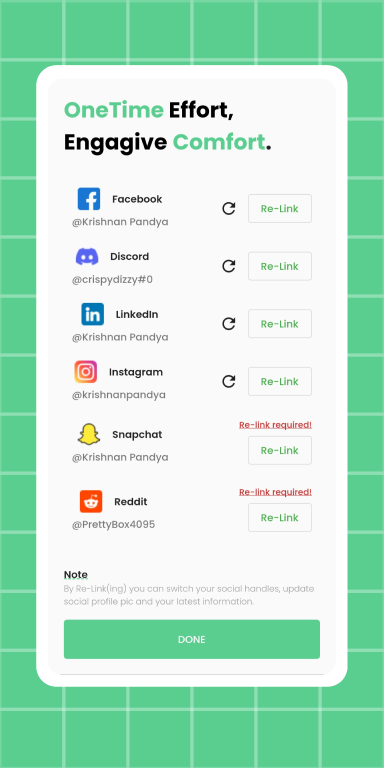
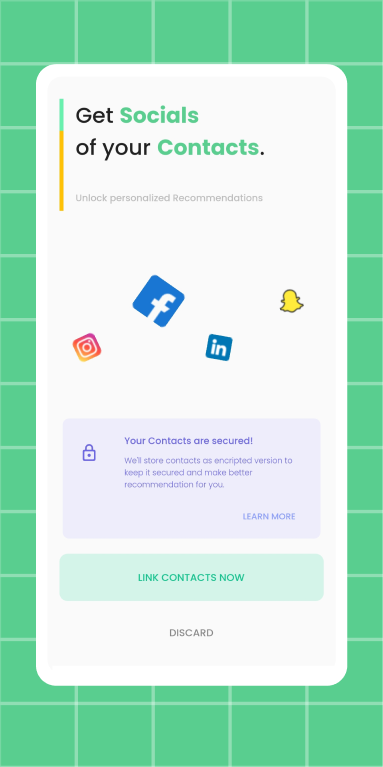
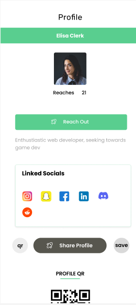

> Designed for social promotion, campus events, and startup showcases.

---

## 📬 Contact

- 👨‍💻 Author: Krishnan A. Pandya  
- 🔗 LinkedIn: [KrishnanPandya](https://linkedin.com/in/krishnanpandya)  
- 📧 Email: krishnanpandya0001@gmail.com  
- 🌐 Website: [reachout-web.vercel.app](https://reachout-web.vercel.app)

